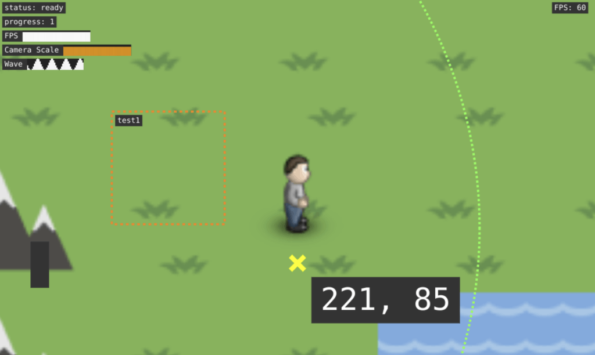

# Game Component: Debug

A component for rendering debug output on a canvas.



## Installation

```bash
npm install @basementuniverse/debug
```

## How to use

Initialise debug before use:

```ts
import Debug from '@basementuniverse/debug';

Debug.initialise();
```

Render the debug output:

```ts
class Game {
  // ...

  public draw(context: CanvasRenderingContext2D) {
    // Draw everything else...

    Debug.draw(context);
  }
}
```

Show a value in a corner of the screen:

```ts
Debug.value('FPS', game.fps);
```

Show a marker somewhere on the screen:

```ts
Debug.marker('player', player.name, player.position);
```

Show a chart in a corner of the screen:
```ts
Debug.chart('actors', game.actors.length);
```

Show a border somewhere on the screen:
```ts
Debug.border('player', '', player.position, { size: player.size });
```

## Options

```ts
const options = { ... };
Debug.initialise(options);
```

| Option | Type | Default | Description |
| --- | --- | --- | --- |
| `margin` | `number` | `10` | Edge of screen margin |
| `padding` | `number` | `4` | Padding between debug text and background |
| `font` | `string` | `10pt Lucida Console, monospace` | The font to use |
| `lineHeight` | `number` | `12` | The height of a line of text |
| `lineMargin` | `number` | `0` | The margin between lines of text |
| `foregroundColour` | `string` | `#fff` | The colour of the text |
| `backgroundColour` | `string` | `#333` | The colour of the background |
| `defaultValue` | `DebugValue` | (see below) | Default options for values |
| `defaultChart` | `DebugChart` | (see below) | Default options for charts |
| `defaultMarker` | `DebugMarker` | (see below) | Default options for markers |
| `defaultBorder` | `DebugBorder` | (see below) | Default options for borders |

### Value options

```ts
type DebugValue = {
  label?: string;
  value?: number | string;
  align: 'left' | 'right';
  showLabel: boolean;
  padding?: number;
  font?: string;
  foregroundColour?: string;
  backgroundColour?: string;
  tags?: string[];
};

Debug.value(label, value, options);
```

### Chart options

```ts
type DebugChart = {
  label?: string;
  values: number[];
  valueBufferSize: number;
  valueBufferStride: number;
  minValue: number;
  maxValue: number;
  barWidth: number;
  barColours?: {
    offset: number;
    colour: string;
  }[];
  align: 'left' | 'right';
  showLabel: boolean;
  padding?: number;
  font?: string;
  foregroundColour?: string;
  backgroundColour?: string;
  chartBackgroundColour?: string;
  tags?: string[];
};

Debug.chart(label, value, options);
```

### Marker options

```ts
type DebugMarker = {
  label?: string;
  value?: number | string;
  position?: vec;
  showLabel: boolean;
  showValue: boolean;
  showMarker: boolean;
  markerSize: number;
  markerLineWidth: number;
  markerStyle: 'x' | '+' | '.';
  markerColour: string;
  markerImage?: HTMLImageElement | HTMLCanvasElement;
  space: 'world' | 'screen';
  padding?: number;
  font?: string;
  labelOffset: vec;
  foregroundColour?: string;
  backgroundColour?: string;
  tags?: string[];
};

Debug.marker(label, value, position, options);
```

### Border options

```ts
type DebugBorder = {
  label?: string;
  value?: number | string;
  position?: vec;
  size?: vec;
  radius?: number;
  showLabel: boolean;
  showValue: boolean;
  showBorder: boolean;
  borderWidth: number;
  borderStyle: 'solid' | 'dashed' | 'dotted';
  borderShape: 'rectangle' | 'circle';
  borderColour: string;
  borderDashSize: number;
  space: 'world' | 'screen';
  padding?: number;
  font?: string;
  labelOffset: vec;
  foregroundColour?: string;
  backgroundColour?: string;
  tags?: string[];
};

Debug.border(label, value, position, options);
```

### Tags

When rendering debug output, you can optionally specify a list of tags:

```ts
Debug.draw(context, ['tag1', 'tag2']);
```

Only values/markers/borders etc. which contain at least one of these tags will be rendered.
